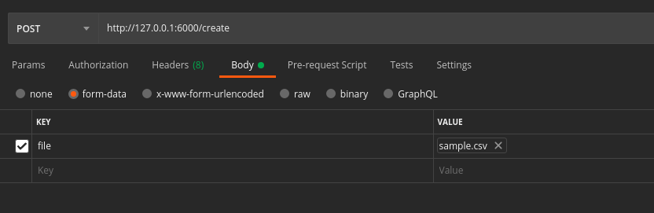

# ATLAN CHALLENGE

## Introduction

The project is developed as a solution to the Atlan challenge. Find the challenge statement [here](https://docs.google.com/document/d/1wma52BMH-07BOxpqWzqIUW5uKIXaCj0j6gPftiwLobE/edit).

## Approach

### Tech Stack

- Python
- Flask

### Idea

To pause, resume and stop the process, I have implemented a thread based solution which polls certain attributes before processing each row.

The solution is inspired by the Mutex concept of Operating System, where a resource has to be shared between two processes, though here I have only one process and the attributes are acting as the resource.

I am ensuring that only one process is in execution at a given time using the approach of the Singleton class as in OOPs.

The attributes `self._running` and `self._terminate` represent the current state of the process. The thread checks the state of these attributes during each iteration and proceeds accordingly.

While processing, the thread is also keeping record of the row currently being processed. We can get the progress till now as a function of `current row` and `total number of rows`.

## Project Architecture

### API Endpoints

The project has been developed as a REST API. The various functionalities have been exposed as endpoints in the `/api/api.py` file.

The various endpoints are :

- `GET /status`: To get the current status of an active process, if it exists.

- `POST /create`: To start a new process, create a POST Request at this endpoint along with the CSV file in form data, with `file` as key.
- `GET /pause`: To pause the in-progress running process, create a POST request at this endpoint.

- `GET /resume`: To resume the in-progress paused process, create a POST request at this endpoint.

- `GET /stop`: To terminate the in-progress paused/running process, create a POST request at this endpoint.

### Handler

The `api.py` uses a Handler object to handle the process associated with the various endpoints. The Handler consists of the implementation of the corresponding functionality of the endpoints.

The Handler also keeps track of the current/last active process and ensures that only one file is processed at any given time. This has been implemented with inspiration from the Singleton class of OOPS.

### Process Thread

The process thread performs the actual processing on the CSV file. The `run` function is the target function for every thread. The logic for processing the CSV file must be implemented in the `run` function.

The run function continuously polls the self.\_running & self.\_terminate attribute to pause, resume, and stop the ongoing process.

For the project, to demonstrate the long processing time of the CSV, the processing has been slowed down using `time.sleep(0.10)`.

## Getting Started

### Installation

Please clone the repository and follow one of the following deployment methods.

#### Docker Image

The project can be deployed directly on the Kubernetes using the docker image, which can be downloaded from the Docker hub.
Please find the image [here](https://hub.docker.com/r/rhnsaxena/atlan-challenge).

Steps:

- Download the image

```
docker pull rhnsaxena/atlan-challenge
```

- Start the container

```
docker run -d -p 6000:5007 rhnsaxena/atlan-challenge
```

Here the ports 6000 and 5007 corresponds to the local and container port respectively.

#### Docker Build

The project can run in a container environment by building the docker image of the existing/modified code.

Steps:

- Configure the ports. Please configure the local and container ports before moving to the next step.<br>
  The port number in `./api/api.py` file and `dockerfile` must match.<br>
  For eg.

  In `dockerfile`

  ```
  EXPOSE 5007
  ```

  In `./api/api.py`

  ```
  app.run(host="0.0.0.0", port="5007")
  ```

- Ensure that the `host` parameter in `app.run()` is `0.0.0.0`.

- Build the image
  ```
    docker build -t atlan-flask:latest .
  ```
- Run the image in a container
  ```
    docker run -it  -d -p 6000:5007 atlan-flask
  ```
  Here the ports 6000 and 5007 corresponds to the local and container port respectively.

#### Local Setup

The project can also run on the local environment.

Steps:

- Install the requirements
  ```
  pip install -r requirements.txt
  ```
- Please configure the port before moving to the next step.
  In ./api/api.py
  ```
  app.run(host="127.0.0.1", port="5007")
  ```
- Ensure that the `host` parameter in `app.run()` is `127.0.0.1`.

- Start the app
  ```
  python3 ./api/api.py
  ```

### Starting a process

To start a new process, create a POST request at /create endpoint along with the CSV file in form data, with `file` as key, as shown in the below image.



## Testing

The app swaps the first two columns of the CSV.
To test the app, please use a CSV that has a header field row and contains only two columns.
You can use the file in the [sample_csv folder](/sample_csv/sample.csv) <b>or</b> [download it from here](https://drive.google.com/file/d/1tgTuFZfgMF-E_ezoq5AuefsejSjyBS-S/view?usp=sharing) to test the app or build your own csv.<br>
Please refer to the following schema to build your CSV file.

```
col1,col2
1,2
3,4
5.6
```

OR

| col1 | col2 |
| ---- | ---- |
| 1    | 2    |
| 3    | 4    |
| 5    | 6    |

<br>

## Responses

The following responses are expected.

### /status

Method

```
GET
```

| Current State            | New State                | Response Code | Response Message                                                                      |
| ------------------------ | ------------------------ | ------------- | ------------------------------------------------------------------------------------- |
| No Active Process        | No Active Process        | 200           | No active process.                                                                    |
| Active Process - running | Active Process - running | 200           | "An active process, currently running. Completed 0.46%, currently on row number 365." |
| Active Process - paused  | Active Process - paused  | 200           | "An active process, currently paused. Completed 1.73%, currently on row number 1380." |

<br>

### /create

Method

```
POST
```

| Current State     | New State      | Response Code | Response Message                                                                                       |
| ----------------- | -------------- | ------------- | ------------------------------------------------------------------------------------------------------ |
| No Active Process | Active Process | 201           | "Process started successfully."                                                                        |
| Active Process    | Active Process | 403           | "A file already in process. Wait till the process gets completed or try stopping the current process." |

<b>Errors</b>

| Error                        | Response Code | Response Message                                      |
| ---------------------------- | ------------- | ----------------------------------------------------- |
| No file attached             | 403           | "Please attach a file. Ensure that the key is 'file'" |
| File attached with wrong key | 403           | "Please attach a file. Ensure that the key is 'file'" |

<br>

### /resume

Method

```
GET
```

| Current State            | New State                | Response Code | Response Message                                                 |
| ------------------------ | ------------------------ | ------------- | ---------------------------------------------------------------- |
| Active Process - paused  | Active Process - running | 200           | "Process resumed. Completed 1.13%, currently on row number 903." |
| Active Process - running | Active Process - runnig  | 403           | "Process already running."                                       |
| No Active Process        | No Active Process        | 403           | "No active process."                                             |

<br>

### /pause

Method

```
GET
```

| Current State            | New State               | Response Code | Response Message                                                |
| ------------------------ | ----------------------- | ------------- | --------------------------------------------------------------- |
| Active Process - running | Active Process - paused | 200           | "Process paused. Completed 1.13%, currently on row number 903." |
| Active Process - paused  | Active Process - paused | 403           | "Process already paused."                                       |
| No Active Process        | No Active Process       | 403           | "No active process."                                            |

<br>

### /stop

Method

```
GET
```

| Current State             | New State         | Response Code | Response Message                                                  |
| ------------------------- | ----------------- | ------------- | ----------------------------------------------------------------- |
| Active Process - paused   | No Active Process | 200           | "Process stopped at row number 1380. Completed 1.73% processing." |
| Active Process - runnning | No Active Process | 200           | "Process stopped at row number 1380. Completed 1.73% processing." |
| No Active Process         | No Active Process | 403           | "No active process."                                              |
